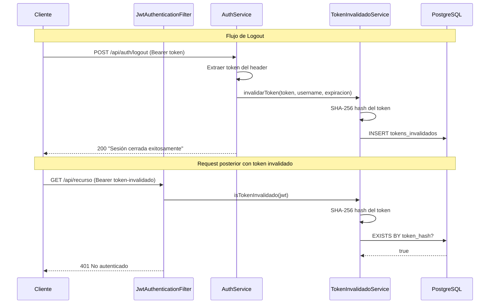

# 🔐 Implementación de Logout — msautenticacion

## Estrategia: Token Blacklist con SHA-256

Se utiliza una **blacklist en PostgreSQL** para invalidar tokens JWT. Cada vez que un usuario hace logout, el hash SHA-256 del token se registra en la tabla `usr.tokens_invalidados`. En cada request autenticado, el `JwtAuthenticationFilter` verifica que el token no esté en la blacklist antes de autenticar al usuario.



## Archivos Creados

| Archivo | Capa | Propósito |
|---------|------|-----------|
| [TokenInvalidado.java](file:///c:/Users/Usuario/OneDrive/Documentos/PROYECTO%20ATLAS/msautenticacion/msautenticacion/src/main/java/com/sistemasgaia/atlas/msautenticacion/models/TokenInvalidado.java) | Model | Entidad JPA para tokens blacklisted |
| [TokenInvalidadoRepository.java](file:///c:/Users/Usuario/OneDrive/Documentos/PROYECTO%20ATLAS/msautenticacion/msautenticacion/src/main/java/com/sistemasgaia/atlas/msautenticacion/repositories/TokenInvalidadoRepository.java) | Repository | `existsByTokenHash()` + limpieza de expirados |
| [TokenInvalidadoService.java](file:///c:/Users/Usuario/OneDrive/Documentos/PROYECTO%20ATLAS/msautenticacion/msautenticacion/src/main/java/com/sistemasgaia/atlas/msautenticacion/services/TokenInvalidadoService.java) | Service | Invalidación, verificación y limpieza programada |
| [V3__crear_tabla_tokens_invalidados.sql](file:///c:/Users/Usuario/OneDrive/Documentos/PROYECTO%20ATLAS/msautenticacion/msautenticacion/src/main/resources/db/migration/V3__crear_tabla_tokens_invalidados.sql) | Migration | DDL de la tabla con índices |

## Archivos Modificados

| Archivo | Cambio |
|---------|--------|
| [JwtService.java](file:///c:/Users/Usuario/OneDrive/Documentos/PROYECTO%20ATLAS/msautenticacion/msautenticacion/src/main/java/com/sistemasgaia/atlas/msautenticacion/security/JwtService.java) | +`extraerExpiracion()` para obtener la fecha de expiración como `LocalDateTime` |
| [JwtAuthenticationFilter.java](file:///c:/Users/Usuario/OneDrive/Documentos/PROYECTO%20ATLAS/msautenticacion/msautenticacion/src/main/java/com/sistemasgaia/atlas/msautenticacion/security/JwtAuthenticationFilter.java) | +Verificación de blacklist antes de autenticar |
| [AuthController.java](file:///c:/Users/Usuario/OneDrive/Documentos/PROYECTO%20ATLAS/msautenticacion/msautenticacion/src/main/java/com/sistemasgaia/atlas/msautenticacion/controllers/AuthController.java) | +`POST /api/auth/logout` endpoint |
| [AuthService.java](file:///c:/Users/Usuario/OneDrive/Documentos/PROYECTO%20ATLAS/msautenticacion/msautenticacion/src/main/java/com/sistemasgaia/atlas/msautenticacion/services/AuthService.java) | +`logout()` método con validación y delegación |
| [SecurityConfig.java](file:///c:/Users/Usuario/OneDrive/Documentos/PROYECTO%20ATLAS/msautenticacion/msautenticacion/src/main/java/com/sistemasgaia/atlas/msautenticacion/security/SecurityConfig.java) | +`/api/auth/logout` como ruta autenticada |
| [MsautenticacionApplication.java](file:///c:/Users/Usuario/OneDrive/Documentos/PROYECTO%20ATLAS/msautenticacion/msautenticacion/src/main/java/com/sistemasgaia/atlas/msautenticacion/MsautenticacionApplication.java) | +`@EnableScheduling` para limpieza automática |

## ⚠️ Paso Manual Requerido

> [!IMPORTANT]
> Debes ejecutar el script SQL en tu base de datos PostgreSQL **antes** de usar la funcionalidad de logout:
> ```sql
> -- Ejecutar en atlas_db
> \i src/main/resources/db/migration/V3__crear_tabla_tokens_invalidados.sql
> ```
> O copia y pega el contenido del archivo SQL directamente en pgAdmin / psql.

## Decisiones de Diseño

| Decisión | Justificación |
|----------|--------------|
| **SHA-256 en vez de token plano** | Seguridad: si la tabla se compromete, no se exponen tokens válidos |
| **Limpieza programada cada hora** | Los tokens expirados ya no sirven; limpiarlos previene crecimiento indefinido de la tabla |
| **Invalidación idempotente** | Llamar logout múltiples veces con el mismo token no causa error ni duplicados |
| **Logout requiere autenticación** | El endpoint es `.authenticated()` — solo un usuario con token válido puede hacer logout |
| **Index en `token_hash`** | La verificación se hace en cada request; el índice garantiza O(1) lookups |

## Ejemplo de Uso con cURL

```bash
# 1. Login
curl -X POST http://localhost:8081/ms-autenticacion/api/auth/login \
  -H "Content-Type: application/json" \
  -d '{"nombreUsuario":"admin","contrasenia":"password123"}'

# Respuesta: {"datos":{"token":"eyJhbGci...",...}}

# 2. Logout (usando el token obtenido del login)
curl -X POST http://localhost:8081/ms-autenticacion/api/auth/logout \
  -H "Authorization: Bearer eyJhbGci..."

# Respuesta: {"status":200,"mensaje":"Sesión cerrada exitosamente"}

# 3. Intentar usar el token invalidado
curl -X GET http://localhost:8081/ms-autenticacion/api/usuarios \
  -H "Authorization: Bearer eyJhbGci..."

# Respuesta: {"status":401,"mensaje":"No autenticado. Token JWT requerido o inválido"}
```
