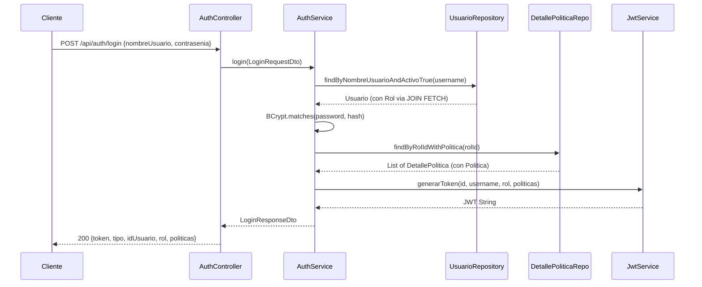
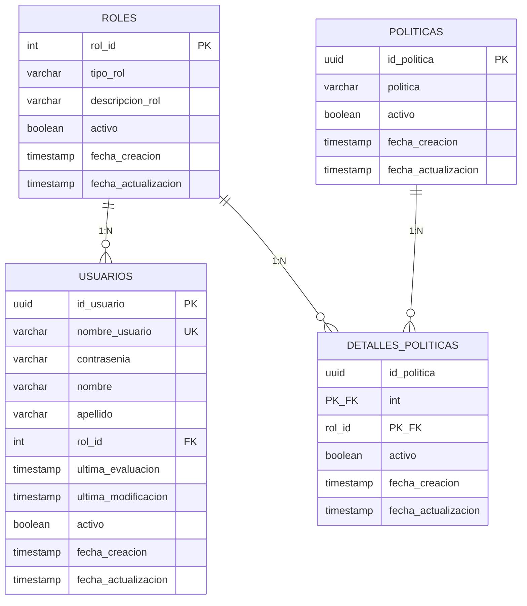

# 🏗️ ATLAS — msautenticacion: Documentación Arquitectónica

## 1. Estructura del Proyecto

```
src/main/java/com/sistemasgaia/atlas/msautenticacion/
│
├── MsautenticacionApplication.java          # Entry point
│
├── config/
│   ├── JpaAuditingConfig.java               # Habilita @CreatedDate/@LastModifiedDate
│   └── OpenApiConfig.java                   # Swagger/OpenAPI con Bearer JWT
│
├── controllers/
│   ├── AuthController.java                  # POST /api/auth/login
│   └── UsuarioController.java               # CRUD /api/usuarios
│
├── dto/
│   ├── ApiResponseDto.java                  # Wrapper genérico de respuestas
│   ├── auth/
│   │   ├── LoginRequestDto.java
│   │   └── LoginResponseDto.java
│   └── usuario/
│       ├── UsuarioRequestDto.java
│       └── UsuarioResponseDto.java
│
├── enums/
│   └── TipoRol.java                        # ADMIN, SUPERVISOR, CLIENTE
│
├── exceptions/
│   ├── BusinessException.java               # 409 Conflict
│   ├── GlobalExceptionHandler.java          # @RestControllerAdvice
│   ├── ResourceNotFoundException.java       # 404
│   └── UnauthorizedException.java           # 401
│
├── models/
│   ├── AuditableEntity.java                 # @MappedSuperclass (auditoría)
│   ├── DetallePolitica.java                 # Join entity (sec.detalles_politicas)
│   ├── DetallePoliticaId.java               # Composite key
│   ├── Politica.java                        # sec.politicas
│   ├── Rol.java                             # sec.roles
│   └── Usuario.java                         # usr.usuarios
│
├── repositories/
│   ├── DetallePoliticaRepository.java
│   ├── PoliticaRepository.java
│   ├── RolRepository.java
│   └── UsuarioRepository.java
│
├── security/
│   ├── CustomUserDetailsService.java        # Carga usuario desde DB
│   ├── JwtAuthenticationFilter.java         # OncePerRequestFilter
│   ├── JwtService.java                      # Generación/validación JWT
│   └── SecurityConfig.java                  # SecurityFilterChain
│
├── services/
│   ├── AuthService.java                     # Login + JWT
│   └── UsuarioService.java                  # CRUD usuarios
│
└── utils/
    ├── BcryptUtil.java                      # Utilidad para generar hashes
    └── GenerateHash.java                    # Generador simple
```

---

## 2. Endpoints

| Método | Ruta | Auth | Descripción |
|--------|------|------|-------------|
| `POST` | `/api/auth/login` | ❌ Público | Autenticación + JWT |
| `GET` | `/api/usuarios` | ✅ Bearer | Listar todos los usuarios |
| `GET` | `/api/usuarios/{id}` | ✅ Bearer | Buscar usuario por UUID |
| `POST` | `/api/usuarios` | ✅ Bearer | Crear usuario |
| `PUT` | `/api/usuarios/{id}` | ✅ Bearer | Actualizar usuario |
| `DELETE` | `/api/usuarios/{id}` | ✅ Bearer | Eliminar (soft delete) |
| `GET` | `/actuator/health` | ❌ Público | Health check |
| `GET` | `/swagger-ui.html` | ❌ Público | Swagger UI |

> [!NOTE]
> Todos los endpoints (excepto login, swagger, health) requieren header `Authorization: Bearer <token>`.

---

## 3. Flujo de Autenticación



---

## 4. Modelo Relacional



> [!IMPORTANT]
> - Esquema `sec` → roles, politicas, detalles_politicas
> - Esquema `usr` → usuarios

---

## 5. JWT Claims

El token JWT generado contiene:

```json
{
  "sub": "admin",
  "idUsuario": "a1b2c3d4-...",
  "rol": "ADMIN",
  "politicas": ["CREAR_USUARIO", "ELIMINAR_USUARIO", "VER_REPORTES"],
  "iat": 1716753600,
  "exp": 1716840000
}
```

---

## 6. Datos Semilla

| Entidad | Datos |
|---------|-------|
| **Roles** | ADMIN, SUPERVISOR, CLIENTE |
| **Políticas** | CREAR_USUARIO, ELIMINAR_USUARIO, VER_REPORTES |
| **Asignaciones** | ADMIN → todas las políticas, SUPERVISOR → VER_REPORTES |
| **Usuario** | admin / admin123 (BCrypt hash) |

---

## 7. Cómo Ejecutar

### Opción A: Docker Compose (recomendado)
```bash
docker-compose up --build
```
Esto levanta PostgreSQL + la app. La DB se inicializa automáticamente con `init.sql`.

### Opción B: Local
1. Tener PostgreSQL corriendo en `localhost:5432`
2. Crear base de datos `atlas_db`
3. Ejecutar `src/main/resources/db/init.sql`
4. Ejecutar:
```bash
./mvnw spring-boot:run
```

### Probar login:
```bash
curl -X POST http://localhost:8081/ms-autenticacion/api/auth/login \
  -H "Content-Type: application/json" \
  -d '{"nombreUsuario":"admin","contrasenia":"admin123"}'
```

### Usar token para CRUD:
```bash
curl http://localhost:8081/ms-autenticacion/api/usuarios \
  -H "Authorization: Bearer <TOKEN>"
```

---

## 8. Decisiones Arquitectónicas

| Decisión | Justificación |
|----------|---------------|
| **Soft delete** | `activo = false` en vez de DELETE físico para auditoría |
| **FetchType.EAGER en Usuario→Rol** | El rol siempre se necesita en autenticación |
| **FetchType.LAZY en colecciones** | Evita cargar datos innecesarios |
| **@JsonIgnore en colecciones** | Previene recursividad infinita en serialización |
| **JOIN FETCH en queries** | Evita N+1 problem en autenticación |
| **Composite key en DetallePolitica** | Relación M:N sin ID artificial |
| **ApiResponseDto wrapper** | Respuestas consistentes en toda la API |
| **Constructor injection (Lombok)** | `@RequiredArgsConstructor` para inmutabilidad |
| **Stateless sessions** | JWT no requiere estado en servidor |
| **BCrypt** | Estándar de la industria para hashing de contraseñas |
