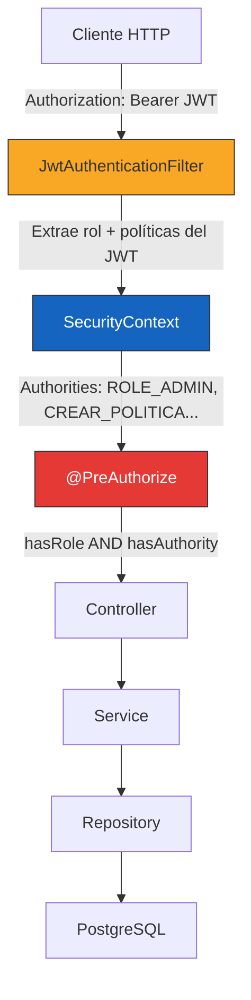
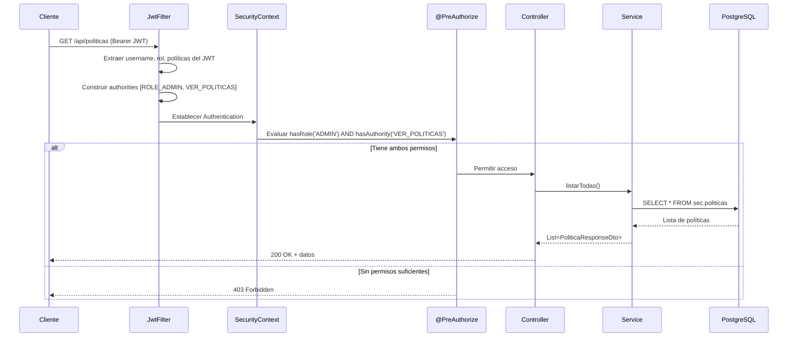
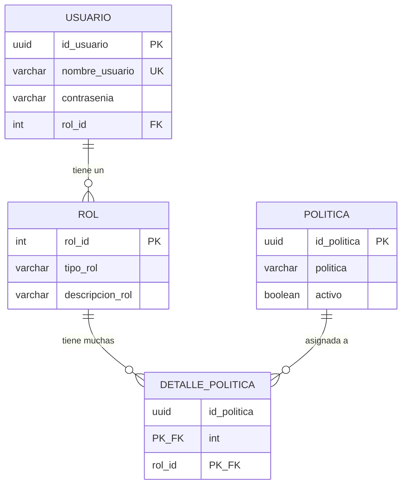

# Implementación RBAC Empresarial — msautenticacion

## 1. Arquitectura de Autorización



## 2. Flujo Completo de Autorización RBAC



## 3. Archivos Creados / Modificados

### Archivos Nuevos (6)

| Archivo | Tipo | Propósito |
|---------|------|-----------|
| [PoliticaRequestDto.java](file:///c:/Users/Usuario/OneDrive/Documentos/PROYECTO%20ATLAS/msautenticacion/msautenticacion/src/main/java/com/sistemasgaia/atlas/msautenticacion/dto/politica/PoliticaRequestDto.java) | DTO | Request para crear/editar política |
| [PoliticaResponseDto.java](file:///c:/Users/Usuario/OneDrive/Documentos/PROYECTO%20ATLAS/msautenticacion/msautenticacion/src/main/java/com/sistemasgaia/atlas/msautenticacion/dto/politica/PoliticaResponseDto.java) | DTO | Respuesta de política con auditoría |
| [AsignarPoliticasRequestDto.java](file:///c:/Users/Usuario/OneDrive/Documentos/PROYECTO%20ATLAS/msautenticacion/msautenticacion/src/main/java/com/sistemasgaia/atlas/msautenticacion/dto/politica/AsignarPoliticasRequestDto.java) | DTO | Request con lista de UUIDs de políticas |
| [AsignarPoliticasResponseDto.java](file:///c:/Users/Usuario/OneDrive/Documentos/PROYECTO%20ATLAS/msautenticacion/msautenticacion/src/main/java/com/sistemasgaia/atlas/msautenticacion/dto/politica/AsignarPoliticasResponseDto.java) | DTO | Respuesta con resumen de asignación |
| [PoliticaController.java](file:///c:/Users/Usuario/OneDrive/Documentos/PROYECTO%20ATLAS/msautenticacion/msautenticacion/src/main/java/com/sistemasgaia/atlas/msautenticacion/controllers/PoliticaController.java) | Controller | CRUD políticas + asignación |
| [PoliticaService.java](file:///c:/Users/Usuario/OneDrive/Documentos/PROYECTO%20ATLAS/msautenticacion/msautenticacion/src/main/java/com/sistemasgaia/atlas/msautenticacion/services/PoliticaService.java) | Service | Lógica de negocio políticas |
| [AutorizacionService.java](file:///c:/Users/Usuario/OneDrive/Documentos/PROYECTO%20ATLAS/msautenticacion/msautenticacion/src/main/java/com/sistemasgaia/atlas/msautenticacion/services/AutorizacionService.java) | Service | Resolución RBAC de políticas por rol |

### Archivos Modificados (5)

| Archivo | Cambios |
|---------|---------|
| [PoliticaRepository.java](file:///c:/Users/Usuario/OneDrive/Documentos/PROYECTO%20ATLAS/msautenticacion/msautenticacion/src/main/java/com/sistemasgaia/atlas/msautenticacion/repositories/PoliticaRepository.java) | +`existsByNombrePolitica()`, +`findByNombrePolitica()` |
| [CustomUserDetailsService.java](file:///c:/Users/Usuario/OneDrive/Documentos/PROYECTO%20ATLAS/msautenticacion/msautenticacion/src/main/java/com/sistemasgaia/atlas/msautenticacion/security/CustomUserDetailsService.java) | Carga ROL + POLÍTICAS como GrantedAuthority |
| [JwtAuthenticationFilter.java](file:///c:/Users/Usuario/OneDrive/Documentos/PROYECTO%20ATLAS/msautenticacion/msautenticacion/src/main/java/com/sistemasgaia/atlas/msautenticacion/security/JwtAuthenticationFilter.java) | Extrae ROL + POLÍTICAS del JWT, sin consultar BD |
| [SecurityConfig.java](file:///c:/Users/Usuario/OneDrive/Documentos/PROYECTO%20ATLAS/msautenticacion/msautenticacion/src/main/java/com/sistemasgaia/atlas/msautenticacion/security/SecurityConfig.java) | +Handlers personalizados 401/403 con JSON |
| [UsuarioController.java](file:///c:/Users/Usuario/OneDrive/Documentos/PROYECTO%20ATLAS/msautenticacion/msautenticacion/src/main/java/com/sistemasgaia/atlas/msautenticacion/controllers/UsuarioController.java) | +Endpoint `POST /api/usuarios/{id}/politicas` |
| [GlobalExceptionHandler.java](file:///c:/Users/Usuario/OneDrive/Documentos/PROYECTO%20ATLAS/msautenticacion/msautenticacion/src/main/java/com/sistemasgaia/atlas/msautenticacion/exceptions/GlobalExceptionHandler.java) | +Handler para AccessDeniedException (403) |

## 4. Endpoints Implementados

### CRUD Políticas

| Método | Endpoint | Requiere | Descripción |
|--------|----------|----------|-------------|
| `GET` | `/api/politicas` | `ROLE_ADMIN` + `VER_POLITICAS` | Listar todas las políticas |
| `GET` | `/api/politicas/{id}` | `ROLE_ADMIN` + `VER_POLITICAS` | Buscar política por ID |
| `POST` | `/api/politicas` | `ROLE_ADMIN` + `CREAR_POLITICA` | Crear nueva política |
| `PUT` | `/api/politicas/{id}` | `ROLE_ADMIN` + `EDITAR_POLITICA` | Actualizar política |
| `DELETE` | `/api/politicas/{id}` | `ROLE_ADMIN` + `ELIMINAR_POLITICA` | Eliminar política (soft delete) |

### Asignación de Políticas

| Método | Endpoint | Requiere | Descripción |
|--------|----------|----------|-------------|
| `POST` | `/api/usuarios/{usuarioId}/politicas` | `ROLE_ADMIN` + `ASIGNAR_POLITICAS` | Asignar políticas al rol del usuario |
| `POST` | `/api/politicas/usuarios/{usuarioId}` | `ROLE_ADMIN` + `ASIGNAR_POLITICAS` | Ruta alternativa (mismo handler) |

## 5. Ejemplos de Request / Response

### Crear Política

```http
POST /api/politicas
Authorization: Bearer eyJhbGciOiJI...
Content-Type: application/json

{
  "nombrePolitica": "CREAR_REPORTE"
}
```

```json
{
  "status": 201,
  "mensaje": "Política creada correctamente",
  "datos": {
    "id": "550e8400-e29b-41d4-a716-446655440000",
    "nombrePolitica": "CREAR_REPORTE",
    "activo": true,
    "fechaCreacion": "2026-05-27T12:30:00",
    "fechaActualizacion": null
  },
  "timestamp": "2026-05-27T12:30:00"
}
```

### Asignar Políticas a Usuario

```http
POST /api/usuarios/a1b2c3d4-e5f6-7890-abcd-ef1234567890/politicas
Authorization: Bearer eyJhbGciOiJI...
Content-Type: application/json

{
  "politicasIds": [
    "550e8400-e29b-41d4-a716-446655440000",
    "660e8400-e29b-41d4-a716-446655440001"
  ]
}
```

```json
{
  "status": 200,
  "mensaje": "Políticas asignadas correctamente",
  "datos": {
    "nombreUsuario": "admin01",
    "tipoRol": "ADMIN",
    "politicasAsignadas": 1,
    "politicasDuplicadas": 1,
    "politicasNuevas": ["CREAR_REPORTE"],
    "politicasYaExistentes": ["VER_POLITICAS"]
  },
  "timestamp": "2026-05-27T12:31:00"
}
```

### Error 403 — Sin permisos

```json
{
  "status": 403,
  "mensaje": "Acceso denegado. No tiene los permisos necesarios para esta operación",
  "timestamp": "2026-05-27T12:32:00"
}
```

### Error de validación — Nombre de política inválido

```json
{
  "status": 400,
  "mensaje": "Error de validación",
  "errores": [
    "El nombre de la política solo debe contener letras mayúsculas y guiones bajos (ej: CREAR_POLITICA)"
  ],
  "timestamp": "2026-05-27T12:33:00"
}
```

## 6. Modelo de Datos RBAC



## 7. Cómo funciona la cadena de autorización

```
Login → AuthService
  │
  ├─ 1. Busca usuario activo por username
  ├─ 2. Valida contraseña BCrypt
  ├─ 3. Obtiene ROL del usuario
  ├─ 4. Consulta políticas del ROL (DetallePoliticaRepository)
  ├─ 5. Genera JWT con claims: { rol: "ADMIN", politicas: ["CREAR_POLITICA", ...] }
  └─ 6. Retorna token al cliente

Request protegido → JwtAuthenticationFilter
  │
  ├─ 1. Extrae JWT del header "Authorization: Bearer ..."
  ├─ 2. Valida firma + expiración
  ├─ 3. Extrae ROL del JWT → ROLE_ADMIN (GrantedAuthority)
  ├─ 4. Extrae POLÍTICAS del JWT → CREAR_POLITICA, VER_POLITICAS... (GrantedAuthority)
  ├─ 5. Crea UsernamePasswordAuthenticationToken con todas las authorities
  └─ 6. Establece en SecurityContext

@PreAuthorize("hasRole('ADMIN') and hasAuthority('CREAR_POLITICA')")
  │
  ├─ hasRole('ADMIN') → busca "ROLE_ADMIN" en authorities ✅
  ├─ hasAuthority('CREAR_POLITICA') → busca "CREAR_POLITICA" en authorities ✅
  └─ Si ambos OK → permite acceso al endpoint
     Si alguno falta → 403 Forbidden
```

> [!IMPORTANT]
> Las authorities se resuelven **directamente del JWT**, sin consultar la base de datos en cada request. Esto mejora significativamente el rendimiento. El `CustomUserDetailsService` solo se usa durante el proceso de login.

> [!WARNING]
> Si se modifican las políticas de un rol en la BD, los tokens ya emitidos seguirán teniendo las políticas anteriores hasta que expiren. El usuario debe re-autenticarse para obtener las nuevas políticas.

## 8. Políticas recomendadas para inicializar

```sql
-- Insertar políticas base del sistema
INSERT INTO sec.politicas (id_politica, politica, activo, fecha_creacion) VALUES
  (gen_random_uuid(), 'CREAR_POLITICA', true, NOW()),
  (gen_random_uuid(), 'EDITAR_POLITICA', true, NOW()),
  (gen_random_uuid(), 'ELIMINAR_POLITICA', true, NOW()),
  (gen_random_uuid(), 'VER_POLITICAS', true, NOW()),
  (gen_random_uuid(), 'ASIGNAR_POLITICAS', true, NOW());

-- Asignar todas las políticas al rol ADMIN (asumiendo rol_id = 1 para ADMIN)
INSERT INTO sec.detalles_politicas (id_politica, rol_id, fecha_creacion)
SELECT id_politica, 1, NOW()
FROM sec.politicas
WHERE activo = true;
```
