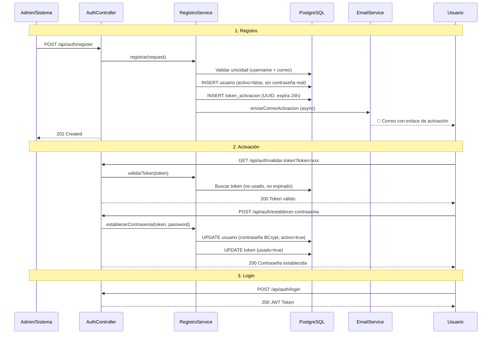

# 📧 Registro de Usuarios con Activación por Correo

## Flujo General



## Archivos Creados (9)

| Archivo | Capa | Propósito |
|---------|------|-----------|
| [TipoToken.java](file:///c:/Users/Usuario/OneDrive/Documentos/PROYECTO%20ATLAS/msautenticacion/msautenticacion/src/main/java/com/sistemasgaia/atlas/msautenticacion/enums/TipoToken.java) | Enum | `ACTIVACION` / `RECUPERACION` |
| [TokenActivacion.java](file:///c:/Users/Usuario/OneDrive/Documentos/PROYECTO%20ATLAS/msautenticacion/msautenticacion/src/main/java/com/sistemasgaia/atlas/msautenticacion/models/TokenActivacion.java) | Model | Entidad JPA con lifecycle methods |
| [TokenActivacionRepository.java](file:///c:/Users/Usuario/OneDrive/Documentos/PROYECTO%20ATLAS/msautenticacion/msautenticacion/src/main/java/com/sistemasgaia/atlas/msautenticacion/repositories/TokenActivacionRepository.java) | Repository | CRUD + invalidación + limpieza |
| [RegistroRequestDto.java](file:///c:/Users/Usuario/OneDrive/Documentos/PROYECTO%20ATLAS/msautenticacion/msautenticacion/src/main/java/com/sistemasgaia/atlas/msautenticacion/dto/auth/RegistroRequestDto.java) | DTO | Registro (sin contraseña) |
| [RegistroResponseDto.java](file:///c:/Users/Usuario/OneDrive/Documentos/PROYECTO%20ATLAS/msautenticacion/msautenticacion/src/main/java/com/sistemasgaia/atlas/msautenticacion/dto/auth/RegistroResponseDto.java) | DTO | Confirmación de registro |
| [EstablecerContraseniaRequestDto.java](file:///c:/Users/Usuario/OneDrive/Documentos/PROYECTO%20ATLAS/msautenticacion/msautenticacion/src/main/java/com/sistemasgaia/atlas/msautenticacion/dto/auth/EstablecerContraseniaRequestDto.java) | DTO | Token + nueva contraseña + confirmación |
| [RecuperarContraseniaRequestDto.java](file:///c:/Users/Usuario/OneDrive/Documentos/PROYECTO%20ATLAS/msautenticacion/msautenticacion/src/main/java/com/sistemasgaia/atlas/msautenticacion/dto/auth/RecuperarContraseniaRequestDto.java) | DTO | Solo correo electrónico |
| [ValidarTokenResponseDto.java](file:///c:/Users/Usuario/OneDrive/Documentos/PROYECTO%20ATLAS/msautenticacion/msautenticacion/src/main/java/com/sistemasgaia/atlas/msautenticacion/dto/auth/ValidarTokenResponseDto.java) | DTO | Estado del token para frontend |
| [TokenActivacionService.java](file:///c:/Users/Usuario/OneDrive/Documentos/PROYECTO%20ATLAS/msautenticacion/msautenticacion/src/main/java/com/sistemasgaia/atlas/msautenticacion/services/TokenActivacionService.java) | Service | Ciclo de vida de tokens |
| [EmailService.java](file:///c:/Users/Usuario/OneDrive/Documentos/PROYECTO%20ATLAS/msautenticacion/msautenticacion/src/main/java/com/sistemasgaia/atlas/msautenticacion/services/EmailService.java) | Service | Envío asíncrono con templates HTML |
| [RegistroService.java](file:///c:/Users/Usuario/OneDrive/Documentos/PROYECTO%20ATLAS/msautenticacion/msautenticacion/src/main/java/com/sistemasgaia/atlas/msautenticacion/services/RegistroService.java) | Service | Orquestador de registro y contraseñas |
| [V4 SQL](file:///c:/Users/Usuario/OneDrive/Documentos/PROYECTO%20ATLAS/msautenticacion/msautenticacion/src/main/resources/db/migration/V4__registro_activacion_contrasenia.sql) | Migration | DDL para correo + tokens_activacion |

## Archivos Modificados (8)

| Archivo | Cambio |
|---------|--------|
| [Usuario.java](file:///c:/Users/Usuario/OneDrive/Documentos/PROYECTO%20ATLAS/msautenticacion/msautenticacion/src/main/java/com/sistemasgaia/atlas/msautenticacion/models/Usuario.java) | +campo `correo` |
| [UsuarioRepository.java](file:///c:/Users/Usuario/OneDrive/Documentos/PROYECTO%20ATLAS/msautenticacion/msautenticacion/src/main/java/com/sistemasgaia/atlas/msautenticacion/repositories/UsuarioRepository.java) | +`existsByCorreo`, `findByCorreo`, `findByCorreoAndActivoTrue` |
| [RolRepository.java](file:///c:/Users/Usuario/OneDrive/Documentos/PROYECTO%20ATLAS/msautenticacion/msautenticacion/src/main/java/com/sistemasgaia/atlas/msautenticacion/repositories/RolRepository.java) | +`findByTipoRol` |
| [UsuarioRequestDto.java](file:///c:/Users/Usuario/OneDrive/Documentos/PROYECTO%20ATLAS/msautenticacion/msautenticacion/src/main/java/com/sistemasgaia/atlas/msautenticacion/dto/usuario/UsuarioRequestDto.java) | +campo `correo` con `@Email` |
| [UsuarioResponseDto.java](file:///c:/Users/Usuario/OneDrive/Documentos/PROYECTO%20ATLAS/msautenticacion/msautenticacion/src/main/java/com/sistemasgaia/atlas/msautenticacion/dto/usuario/UsuarioResponseDto.java) | +campo `correo` |
| [UsuarioService.java](file:///c:/Users/Usuario/OneDrive/Documentos/PROYECTO%20ATLAS/msautenticacion/msautenticacion/src/main/java/com/sistemasgaia/atlas/msautenticacion/services/UsuarioService.java) | +validación y mapeo de correo en CRUD |
| [AuthController.java](file:///c:/Users/Usuario/OneDrive/Documentos/PROYECTO%20ATLAS/msautenticacion/msautenticacion/src/main/java/com/sistemasgaia/atlas/msautenticacion/controllers/AuthController.java) | +6 endpoints nuevos |
| [SecurityConfig.java](file:///c:/Users/Usuario/OneDrive/Documentos/PROYECTO%20ATLAS/msautenticacion/msautenticacion/src/main/java/com/sistemasgaia/atlas/msautenticacion/security/SecurityConfig.java) | +5 rutas públicas |
| [pom.xml](file:///c:/Users/Usuario/OneDrive/Documentos/PROYECTO%20ATLAS/msautenticacion/msautenticacion/pom.xml) | +`spring-boot-starter-mail` |
| [application.yaml](file:///c:/Users/Usuario/OneDrive/Documentos/PROYECTO%20ATLAS/msautenticacion/msautenticacion/src/main/resources/application.yaml) | +SMTP config + atlas config |
| [MsautenticacionApplication.java](file:///c:/Users/Usuario/OneDrive/Documentos/PROYECTO%20ATLAS/msautenticacion/msautenticacion/src/main/java/com/sistemasgaia/atlas/msautenticacion/MsautenticacionApplication.java) | +`@EnableAsync` |

## Endpoints

| Método | Endpoint | Auth | Descripción |
|--------|----------|------|-------------|
| `POST` | `/api/auth/register` | ❌ Público | Registra usuario + envía correo |
| `GET` | `/api/auth/validar-token?token=xxx` | ❌ Público | Valida token antes de mostrar form |
| `POST` | `/api/auth/establecer-contrasenia` | ❌ Público | Establece contraseña con token |
| `POST` | `/api/auth/recuperar-contrasenia` | ❌ Público | Solicita reset de contraseña |
| `POST` | `/api/auth/reenviar-activacion` | ❌ Público | Reenvía correo de activación |

## Pasos para Configurar

> [!IMPORTANT]
> **3 pasos obligatorios antes de levantar la aplicación:**

### 1. Ejecutar migración SQL
```sql
-- En atlas_db (PostgreSQL)
\i src/main/resources/db/migration/V4__registro_activacion_contrasenia.sql
```

### 2. Configurar SMTP
En `application.yaml` o variables de entorno:
```bash
# Con Gmail (requiere App Password)
set SMTP_USERNAME=tu-correo@gmail.com
set SMTP_PASSWORD=tu-app-password-de-16-chars
set FRONTEND_URL=http://localhost:4200
```

### 3. Gmail App Password
1. Ir a [Google App Passwords](https://myaccount.google.com/apppasswords)
2. Crear contraseña de aplicación para "Mail"
3. Usar el password de 16 caracteres generado

## Decisiones de Diseño

| Decisión | Justificación |
|----------|--------------|
| **Registro sin contraseña** | El usuario la establece desde el correo — más seguro que enviar contraseña temporal |
| **Usuario inactivo al crear** | `activo=false` hasta que active la cuenta — previene uso sin verificar correo |
| **Token UUID v4** | Criptográficamente seguro, 122 bits de entropía |
| **Single-use tokens** | Cada token solo puede usarse una vez — protección contra reutilización |
| **Tokens previos invalidados** | Al generar nuevo token, los anteriores se invalidan — solo un token activo por tipo |
| **Recuperación silenciosa** | `POST /recuperar-contrasenia` siempre retorna 200 — previene enumeración de usuarios |
| **Envío asíncrono** | `@Async` — el HTTP response no espera al SMTP server |
| **Limpieza programada** | Tokens usados y expirados se eliminan cada 6 horas |
| **Contraseña mínimo 8 chars** | Registro usa 8 chars mínimo (más seguro que el 6 del CRUD existente) |

## Ejemplo de Uso con cURL

```bash
# 1. Registrar usuario
curl -X POST http://localhost:8081/ms-autenticacion/api/auth/register \
  -H "Content-Type: application/json" \
  -d '{
    "nombreUsuario": "jperez",
    "correo": "jperez@gmail.com",
    "nombre": "Juan",
    "apellido": "Pérez"
  }'

# 2. Validar token (del correo recibido)
curl http://localhost:8081/ms-autenticacion/api/auth/validar-token?token=abc-123-uuid

# 3. Establecer contraseña
curl -X POST http://localhost:8081/ms-autenticacion/api/auth/establecer-contrasenia \
  -H "Content-Type: application/json" \
  -d '{
    "token": "abc-123-uuid",
    "nuevaContrasenia": "MiPassword123!",
    "confirmarContrasenia": "MiPassword123!"
  }'

# 4. Recuperar contraseña
curl -X POST http://localhost:8081/ms-autenticacion/api/auth/recuperar-contrasenia \
  -H "Content-Type: application/json" \
  -d '{"correo": "jperez@gmail.com"}'
```
